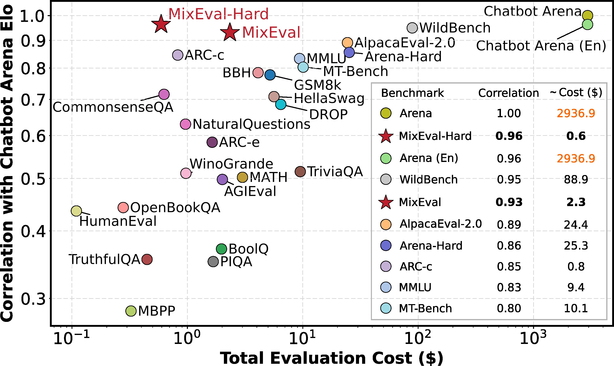

<p align="center" width="100%">

</p>
<p align="center"><a href="https://mixeval.github.io/">🏠 Homepage</a> | <a href="https://mixeval.github.io/#leaderboard">🏆 Leaderboard</a> | <a href="https://arxiv.org/abs/2406.06565">📜 arXiv</a> | <a href="https://beneficial-chips-08e.notion.site/Don-t-Build-Random-Evals-Principles-for-General-Purpose-Model-Evaluation-bd5a85ba10f447bc9ac560050f67270b">📝 blog</a> | <a href="https://huggingface.co/datasets/MixEval/MixEval">🤗 HF Dataset</a> | <a href="https://huggingface.co/papers/2406.06565">🤗 HF Paper</a> | <a href="https://x.com/NiJinjie/status/1798182749049852411">𝕏 Twitter</a></p>
</p>

---
[](https://github.com/Psycoy/MixEval/tree/main/mix_eval/data)
[](https://x.com/NiJinjie)

<a href="https://hits.seeyoufarm.com"></a>


<br>
<p align="center" width="60%">

</p>

*Benchmark correlations (%) with Chatbot Arena Elo, against the total costs of evaluating a single GPT-3.5-Turbo-0125 model. MixEval and MixEval-Hard show the highest correlations with Arena Elo and Arena Elo (En) among leading benchmarks. We reference the crowdsourcing price for Amazon Mechanical Turk ($0.05 per vote) when estimating the cost of evaluating a single model on Chatbot Arena (approximately $2,936). Chatbot Arena is prohibitively expensive, while MixEval and MixEval-Hard are cheap and cost-effective alternatives. For more details, please refer to our paper.*

<br>

# ⚡ News
[2024-06-29] Our evaluation suite now supports evaluating local checkpoints, check [here](docs/evaluate_instructions.md#evaluating-local-checkpoint) for details! 

[2024-06-29] Our evaluation suite now supports other apis for model parser, check [here](docs/evaluate_instructions.md#use-other-apis-for-model-parser).

# MixEval
We introduce **MixEval**, a ground-truth-based dynamic benchmark derived from off-the-shelf benchmark mixtures, which evaluates LLMs with a highly capable model ranking (i.e., 0.96 correlation with Chatbot Arena) while running locally and quickly (6% the time and cost of running MMLU), with its queries being stably and effortlessly updated every month to avoid contamination.

The **MixEval** consists of two benchmarks: `MixEval` and `MixEval-Hard`, both updated with our fast, stable pipeline periodically. Both of them contain two splits, i.e., free-form and multiple-choice. Their relationships are presented below:

```
 MixEval (dynamic)
    │
    ├── MixEval
    │   ├──free-form.json
    │   └──multiple-choice.json
    │
    └── MixEval-Hard
        ├──free-form.json
        └──multiple-choice.json
```

> See our [homepage](https://mixeval.github.io/) and [paper](https://arxiv.org/abs/2406.06565) for more details!

<br>

# Click-and-Go LLM Evaluation Suite
This repository hosts the evaluation code and dynamic data release for **MixEval**. The current dynamic benchmark version is displayed at the top of this page. We offer a reliable click-and-go evaluation suite compatible with both **open-source** and **proprietary** models, which includes model response generation and score computation. Additionally, this evaluation suite facilitates straightforward registration of custom models and benchmark data.

> As demonstrated in the [paper](https://arxiv.org/abs/2406.06565), traditional rule-based parsers exhibit significant instability and are prone to considerable errors. We employ either `GPT-3.5-Turbo` or open-source models as our model parser, which has been proven stable in [our](https://arxiv.org/abs/2406.06565) and [this](https://arxiv.org/pdf/2404.01258) study. 

**ATTENTION❗ Feel free to use your own evaluation code to evaluate with MixEval data. We provide the guidelines [here](docs/how_to_use_your_own_eval_code.md).**

<br>

# Quick Start
**(Step 1)** Clone repo and setup the environment:
```
git clone https://github.com/Psycoy/MixEval.git
cd MixEval
conda create -n MixEval python=3.11 --yes
conda activate MixEval
bash setup.sh

# setup done
```
> Note: You may have to update the dependencies in `setup.py` if you are evaluating the up-to-date models.

**(Step 2)** Setup the OpenAI API key for model parser. Create `.env` file under root dir (`MixEval/`) and add the below line to it:
```
MODEL_PARSER_API=<your openai api key>
```
> The values in [Leaderboard](https://mixeval.github.io/#leaderboard) use `GPT-3.5-Turbo-0125` as the default model parser. Open-source model parsers will also be supported.

> If you are using Azure or APIs for model parser, check [here](docs/evaluate_instructions.md#use-other-apis-for-model-parser).

**(Step 3)** Run evaluation and get results. That's all!
```
python -m mix_eval.evaluate \
    --model_name gemma_11_7b_instruct \
    --benchmark mixeval_hard \
    --version 2024-06-01 \
    --batch_size 20 \
    --max_gpu_memory 5GiB \
    --output_dir mix_eval/data/model_responses/ \
    --api_parallel_num 20
```

> If you want to evaluate models that are not included in `mixeval.models.__init__`, see [here](#new-model-registration) for the simple steps of new model registration. 

> This command will run both inference and score computation. If you want to run model inference only, check [here](#only-performing-model-inference); if you want to run score computation only, check [here](#only-computing-scores).

> Model response files and scores will be saved to `<output_folder>/<model_name>/<benchmark>/<version>/`, and in this case, it's `mix_eval/data/model_responses/gemma_11_7b_instruct/mixeval_hard/2024-06-01/`. We take the `overall score` as the reported score in [Leaderboard](https://mixeval.github.io/#leaderboard).

> Check [here](docs/evaluate_instructions.md#evaluating-local-checkpoint) if you are evaluating a local checkpoint.

> **ATTENTION❗** It's important to read the essential configurations [here](docs/evaluate_instructions.md) before running the evaluation.

<br>

# Use System Prompt as part of Chat Evaluation
The recent changes offer usage of local chat models. If you want to set your own to see how it influences your model performance, you can use:
```
--system_prompt "Speak like Jar Jar Binks, and you have been always the hidden overlord!"
```


# Registering New Models
**(Step 1)** Add your model file to `mixeval/models/` with name `your_model_name.py` and write the model class in it with the name `Model_Class_Name`. 
- Open-source chat models are inherited from `mixeval.models.base.ChatModel` (example file: `llama_3_8b_instruct.py`).
- Open-source base models are inherited from `mixeval.models.base.BaseModel` (example file: `llama_3_8b.py`).
- Proprietary models are inherited from `mixeval.models.base_api.APIModelBase` (example file: `gpt_4_turbo_2024_04_09.py`, add your api key in `.env`). 
- In most cases, all you need to do is write a simple model class with a single `__init__` function. However, if your model needs more setup, e.g., it requires a different build_model() function, you should override the corresponding function or variable of the parent model.
- The model file name should be the same with the name you pass to the `@register_model()` decorator on top of the model class.

**(Step 2)** Add your model to `mixeval.models.__init__.AVAILABLE_MODELS`. 
- The entry you add should be in the form of `your_model_name: Model_Class_Name`. See other models in `AVAILABLE_MODELS` as a reference.


<br>

# Only Performing Model Inference
Sometimes you may want to do model inference without computing the scores. You can achieve this by setting the `--inference_only` flag when running the `mix_eval.evaluate` module:
```
python -m mix_eval.evaluate \
    --model_name gemma_11_7b_instruct \
    --benchmark mixeval_hard \
    --version 2024-06-01 \
    --batch_size 20 \
    --max_gpu_memory 5GiB \
    --output_folder mix_eval/data/model_responses/ \
    --inference_only
```
> Model response files will be saved to `<output_folder>/<model_name>/<benchmark>/<version>/`, and in this example it's `mix_eval/data/model_responses/gemma_11_7b_instruct/mixeval_hard/2024-06-01/`.

> Check [here](docs/evaluate_instructions.md#evaluating-local-checkpoint) if you are evaluating a local checkpoint.

> **ATTENTION❗** It's important to read the essential configurations [here](docs/evaluate_instructions.md) before running the evaluation.

You can check whether the model response files are complete after running the inference:
```
python -m mix_eval.utils.check_eval_complete \
    --benchmark mixeval_hard \
    --version 2024-06-01 \
    --chat_models_to_check \
    gpt_4o \
    llama_3_70b_instruct \
    claude_3_opus \
    --base_models_to_check \
    none \
    --model_response_dir mix_eval/data/model_responses/ \
    --out_path mix_eval/data/model_responses/eval_checks.log
```
> The checking results will be written to `--out_path`; only problematic files will be recorded.

<br>

# Only Computing Scores
If you want to separately compute the scores, you should 
1. **Prepare your model response files.** You can use either our evaluation suite (refer to [here](#only-performing-model-inference)) or your own (refer to the example response file formats and protocols specified [here](docs/how_to_use_your_own_eval_code.md)).
2. **Run the score computation script**:
    ```
    python -m mix_eval.compute_metrics \
        --benchmark mixeval_hard \
        --version 2024-06-01 \
        --model_response_dir mix_eval/data/model_responses/ \
        --api_parallel_num 20 \
        --models_to_eval \
        gemma_11_7b_instruct \
        gpt_4o \
        claude_3_opus
    ```
> You should set the `--api_parallel_num` properly according to your OpenAI user tier to avoid rate limits. In general, if you are a Tier-5 user, you can set `--api_parallel_num` to 100 or more to parse results in **30 seconds**.

> If you are using Azure or APIs for model parser, check [here](docs/evaluate_instructions.md#use-other-apis-for-model-parser).

> If you are parsing base models' responses, set the `--extract_base_model_response` flag to only retain the meaningful part in models' response to get more stablized parsing results.

> If you finished the model parsing some time ago and now want to display the model results again, add `--compute_score_from_judged_file` flag to avoid calling the model parser api again to save your budget. You have to make sure that there exists the parsed files with the name of `judge_results_ff_model_judge_gpt-3.5-turbo-0125` and `judge_results_mp_model_judge_gpt-3.5-turbo-0125` under the target model response folder, where `gpt-3.5-turbo-0125` denotes the model parser name, `ff` denotes free-form, `mp` denotes multiple-choice.

<br>


# What is MixEval?

> See our [homepage](https://mixeval.github.io/) and [paper](https://arxiv.org/abs/2406.06565) for more details!

**MixEval** is an approach that bridges the gap between real-world user queries and efficient, reproducible evaluation by leveraging user queries mined from the web and matching them with similar queries from existing benchmarks. **MixEval** is also the proposed benchmark built with this approach.

**MixEval-Hard** is the hard version of MixEval, designed to enhance the benchmark's ability to distinguish strong models. It is sampled from MixEval based on model evaluation results, with a higher probability of selecting harder queries. To address distribution deviation, we introduce a rejective sampling process to ensure that the distribution of MixEval-Hard aligns with that of wild queries.

**Dynamic evaluation** is introduced to mitigate the contamination issue. We periodically update the data points in MixEval and MixEval-Hard using our fast, stable pipeline, which performs benchmark mixture with a different batch of wild queries from the same distribution, showing low variance (0.36 Std. on a 0-100 scale) and significant version difference (85% unique query ratio).

<br>

# Why to Use MixEval Benchmarks?
MixEval offers five significant advantages for practitioners: 
- **Accurate** model ranking, demonstrated by a 0.96 correlation with Chatbot Arena1.
- **Fast**, **cheap** and **reproducible** execution, requiring only 6% the time and cost of MMLU and with no dependence on human input.
- **Dynamic** benchmarking enabled by low-effort and stable updating mechanism.
- A **comprehensive** and **less biased** query distribution, as it bases queries on a large-scale web corpus.
- A **fair** grading process, ensured by the ground-truth-based grading mechanism.

<br>

# How Effective is MixEval as a Benchmark Mixture Approach?
MixEval is effective as
- MixEval and MixEval-Hard achieve the highest correlation with Arena Elo and Arena Elo (En) among all benchmarks.
- MixEval improves the correlation with Arena Elo and Arena Elo (En) across all its main benchmark splits.
- MixEval outperforms both benchmark-level and uniform mixtures. 
- MixEval effectively maps real-world user queries to ground-truth-based benchmarks.

<br>

# 🦾 Contribute

Feel free to hit the ⭐**star** button or 🦾**contribute**! We review new issues and PRs regularly and will acknowledge your contributions!

We would like to extend our heartfelt gratitude to the following contributors for their exceptional commitment to this repository:
- @RodriMora
- @teknium1
- @philschmid
- @carstendraschner

<br>

# 📑 Citation

If you found this repository useful, please consider 📑**citing**:

```
@article{ni2024mixeval,
  title={MixEval: Deriving Wisdom of the Crowd from LLM Benchmark Mixtures},
  author={Ni, Jinjie and Xue, Fuzhao and Yue, Xiang and Deng, Yuntian and Shah, Mahir and Jain, Kabir and Neubig, Graham and You, Yang},
  journal={arXiv preprint arXiv:2406.06565},
  year={2024}
}
```